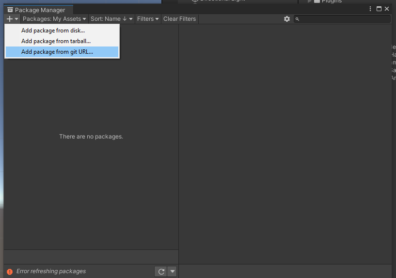
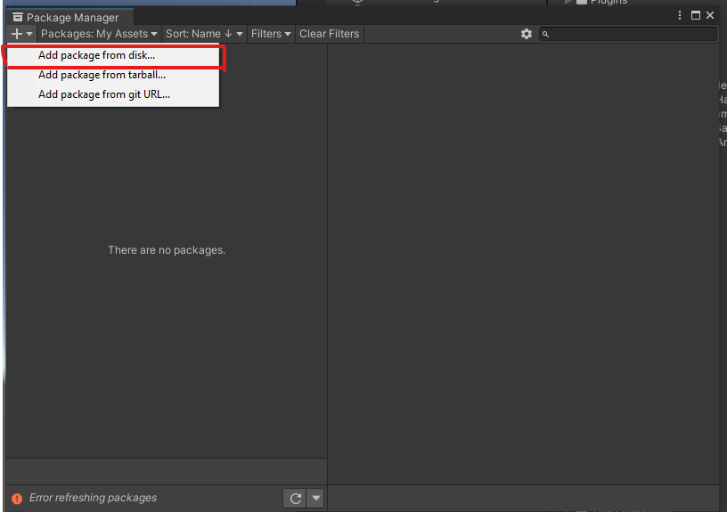
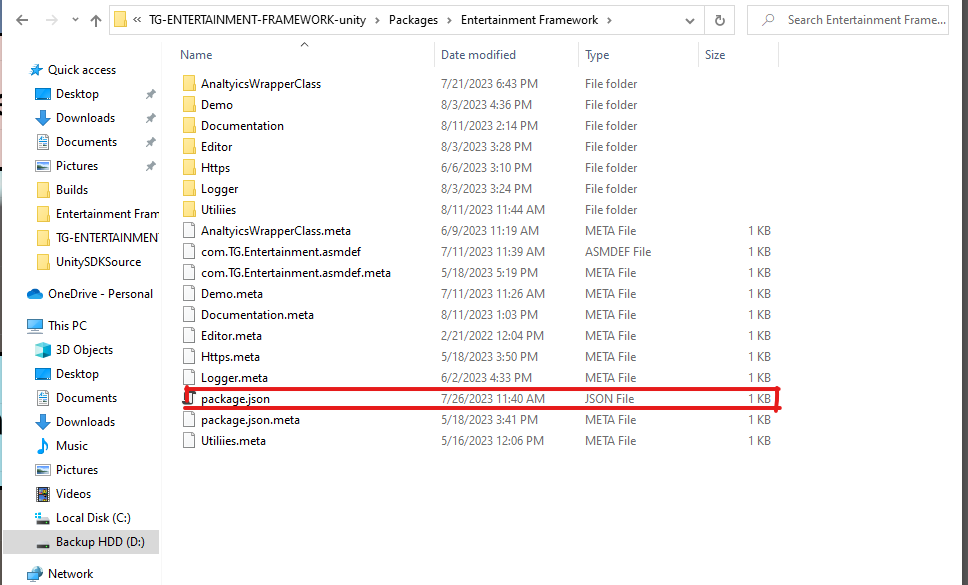

# TG-ENTERTAINMENT-FRAMEWORK-unity
Common framework that includes networking, utilities, and other 3rd party services encapsulated in a singular module.

## Table of Contents

* [About Tatum Games](#about-tatum-games)
* [About MIKROS](#about-mikros)
* [Installation](#installation)
* [Getting Started](#getting-started)
* [SDK Initialization](#sdk-initialization)
* [Analytics](#analytics)
    * [Unity Analytics](#unity-analytics)
    * [Preset Analytics Events for both Unity Analytics and Mikros Analyitcs](#analytics-preset)
* [Https Network](#https-network)
* [CHANGELOG](#changelog)

<a name="about-tatum-games"></a>
## About Tatum Games
[Tatum Games](https://tatumgames.com/) is currently spearheading solutions to many of the pain points in the mobile game ecosystem, such as analytics and advertising. Specifically, they are addressing issues with targeted user acquisition for developers on smartphones.

[table of contents](#table-of-contents)

<a name="about-mikros"></a>
## About MIKROS
In the simplest terms, [MIKROS](https://developer.tatumgames.com/) is an all-in-one mobile analytics platform that is focused on helping developers grow their games and connect with their users. Game developers are enrolled in an information sharing ecosystem that helps identify better insights about user behavior, including user spending habits.

By offering improved user targeting, users of MIKROS will in turn have improved user acquisition, and this improved user acquisition will ultimately lead to increased monetization and growth.

📈 More About MIKROS:
[Explainer](https://youtu.be/_B6szHOWe4o)
[Stage Sever](https://stage-developer.tatumgames.com/))
[Demo Sever](https://demo-developer.tatumgames.com/)) 

[table of contents](#table-of-contents)

<a name="installation"></a>
## Installation
### Installation via Git in UPM

You can install via Git. This assumes you have Git installed on your
computer.

In later versions of Unity, you can import directly via the Package Manager
interface.


Supply the following URL:

```
https://github.com/TATUMGAMES/TG-ENTERTAINMENT-FRAMEWORK-unity-package.git
```
Or 
### Installation via Disk UPM
You can import the package directly from the Git after cloning the project in your local system.
Steps to do so are as follow:
1. Clone the repositry from Sourcetree/GitHub Desktop or Terminal in your system using the following link
```
https://github.com/TATUMGAMES/TG-ENTERTAINMENT-FRAMEWORK-unity-package.git
```
2. In your proejct goto PackageManager and select `Add Package from Disk` option
   
3. Then locate the package.json file of the Clone Repositry in your local system
    
4. Boom you done.

### Installation directly from Unitypackage.
* Install the package directly form the MIKROS WEB Dashboard.

<a name="getting-started"></a>
## Getting Started
In order to use Enternainment Framework, clients (game developers/publishers) must follow these steps
Once Mikros Account Dashboard setup  is completed, then following steps need to be done:

1. In the Unity Editor, select **Entertainment > Edit Settings**
2. In the Inspector tab of **Entertainment Settings**, Enable Unity Analytics for using **Unity Analytics Services**.
3. *(Optional)* If you want manual initialization for the **Unity Analytics**, disable the ***Enable Auto Initialize Unity Analytics Events*** option from the Entertainment Settings. By default, it is kept enabled.
4. *(Optional)* You also have the option to select ***Enable Auto Collecting Data For Tracking Unity Analytics Events***, for giving the constent to Unity Analytics for storing your data in the database. By default, Production API Key is used.


*Note: Steps 3 and 4 can only be followed only if the ***Unity Analytics Services*** is enabled.*

Now user need to Link there project with Unity Account for which they can follow the steps as following link
```
https://docs.unity.com/ugs/en-us/manual/analytics/manual/get-started#Get_started_with_Analytics
````

<a name="sdk-initialization"></a>
## SDK Initialization
#### **Unity Analytics**
Entertainment Framework is initialized automatically by default. But you can manually initialize at any point in the following way:

Make sure to have the following namespaces defined at the top of your scripts:
```
using EntertainmentFramework.UnityAnalytics;
```
Initialization of **Unity Analytics**.
```
AnalyticsManager.Instance.ManualInitializationOfUnityAnalyticsServices();
```

1. If the `Enable Auto Initialize Unity Analytics Events` option is set to TRUE in Editor, then integrators don't require to write any lines of code to initialize Unity Analytics.

2. If the `Enable Auto Initialize Unity Analytics Events` option is set to FALSE in Editor, then its mandatory for integrators to call ` UnityAnalyticsServicesHandler.Instance.InitializeUnityService` method from code.

3. If the `Enable Auto Collecting Data For Tracking Unity Analytics Events` option is set to FALSE in Editor, then its mandatory for integrators to call ` UnityAnalyticsServicesHandler.Instance.StartCollectingData` method from code for Unity Analytics to store data in the database.

*Note: User can also `UnityAnalyticsServicesHandler.Instance.StopCollectingData` from stopping Unity Analytics to collect data.*

### **Mikros SDK**
Refer to the documentation link below:
https://github.com/TATUMGAMES/TG-MIKROS-SDK-unity-package#sdk-initialization


<a name="analytics"></a>
## Analytics


Once the SDK is initialized, you can immediately start logging events (preset or custom) for analytics.
<a name="unity-analytics"></a>
#### **Unity Analytics**

| Parameter        | Type                        | Field    |
| ---------------- |---------------------------- | -------- |
| eventName        | String                      | Required |
| mergedDictionary | Dictionary<string, object>  | Required |

```
UnityAnalyticsServicesHandler.Instance.SendUnityAnaltyicsEvent(eventName, mergedDictionary);
```
<a name="mikros-analytics-preset"></a>
### Preset Analytics Events for both Unity Analytics and Mikros Analyitcs.

```
private void OnSuccessCallBack()
    {
        Debug.Log("Success")
    }
    
private void OnFailureCallback(string message)
    {
         Debug.Log("Failure: "+message)
    }
```

##### Track Game Over Request Object
| Parameter         | Type             | Field    |
| ----------------- | ---------------- | -------- |
| OnSuccessCallBack | Unity Callback   | Optional |
| OnFailureCallback | Unity Callback   | Optional |

```
 PresetEventHandler.Instance.TrackGameOver(OnSuccessCallBack, OnFailureCallback);
```

##### Track Level End Request Object

| Parameter         | Type             | Field    |
| ----------------- | ---------------- | -------- |
| level             | Long             | Required |
| subLevel          | Long             | Optional |
| levelName         | String           | Optional |
| description       | String           | Optional |
| duration          | Float            | Optional |
| success           | Boolean          | Optional |
| OnSuccessCallBack | Unity Callback   | Optional |
| OnFailureCallback | Unity Callback   | Optional |

```
PresetEventHandler.Instance.TrackLevelEnd(level, sublevel, levelName, description, duration, success, OnSuccessCallBack, OnFailureCallback);
```

##### Track Level Start Request Object

| Parameter         | Type           | Field    |
| ----------------- | -------------- | -------- |
| level             | Long           | Required |
| subLevel          | Long           | Optional |
| levelName         | String         | Optional |
| description       | String         | Optional |
| OnSuccessCallBack | Unity Callback | Optional |
| OnFailureCallback | Unity Callback | Optional |

```
PresetEventHandler.Instance.TrackLevelStart(level, subLevel, levelName, description, OnSuccessCallBack, OnFailureCallback);
```

##### Track Level Up Request Object

| Parameter         | Type           | Field    |
| ----------------  | ------ --------| -------- |
| level             | Long           | Required |
| subLevel          | Long           | Optional |
| levelName         | String         | Optional |
| character         | String         | Optional |
| description       | String         | Optional |
| OnSuccessCallBack | Unity Callback | Optional |
| OnFailureCallback | Unity Callback | Optional |

```
PresetEventHandler.Instance.TrackLevelUp(level, subLevel, levelName, character, description, OnSuccessCallBack, OnFailureCallback);
```

##### Track Post Score Request Object

| Parameter         | Type           | Field    |
| ----------------- | -------------- | -------- |
| score             | Long           | Required |
| level             | Long           | Optional |
| subLevel          | Long           | Optional |
| levelName         | String         | Optional |
| character         | String         | Optional |
| OnSuccessCallBack | Unity Callback | Optional |
| OnFailureCallback | Unity Callback | Optional |

```
PresetEventHandler.Instance.TrackPostScore(score, level, sublevel, levelName, character, OnSuccessCallBack, OnFailureCallback);
```

##### Track Share Request Object

| Parameter         | Type           | Field    |
| ----------------- | -------------- | -------- |
| platform          | String         | Optional |
| contentType       | ContentType    | Required |
| OnSuccessCallBack | Unity Callback | Optional |
| OnFailureCallback | Unity Callback | Optional |

```
 PresetEventHandler.Instance.TrackShare(platform, contentType, OnSuccessCallBack, OnFailureCallback);
```

##### Track Sign-in Request Object

| Parameter         | Type           | Field    |
| ----------------- | -------------- | -------- |
| platform          | String         | Optional |
| OnSuccessCallBack | Unity Callback | Optional |
| OnFailureCallback | Unity Callback | Optional |

```
 PresetEventHandler.Instance.TrackSignIn(platform, OnSuccessCallBack, OnFailureCallback);
```

##### Track Sign-up Request Object

| Parameter         | Type           | Field    |
| ----------------- | -------------- | -------- |
| platform          | String         | Optional |
| OnSuccessCallBack | Unity Callback | Optional |
| OnFailureCallback | Unity Callback | Optional |

```
 PresetEventHandler.Instance.TrackSignUp(platform, OnSuccessCallBack, OnFailureCallback);
```

##### Track Start Timer Request Object

| Parameter         | Type           | Field    |
| ----------------- | -------------- | -------- |
| eventName         | String         | Required |
| OnSuccessCallBack | Unity Callback | Optional |
| OnFailureCallback | Unity Callback | Optional |

```
PresetEventHandler.Instance.TrackStartTimer(eventName", OnSuccessCallBack, OnFailureCallback);
```

##### Track Stop Timer Request Object

| Parameter         | Type           | Field    |
| ----------------- | -------------- | -------- |
| eventName         | String         | Required |
| OnSuccessCallBack | Unity Callback | Optional |
| OnFailureCallback | Unity Callback | Optional |

```
PresetEventHandler.Instance.TrackStopTimer(eventName", OnSuccessCallBack, OnFailureCallback);
```

##### Track Tutorial Begin Request Object

| Parameter         | Type           | Field    |
| ----------------- | -------------- | -------- |
| OnSuccessCallBack | Unity Callback | Optional |
| OnFailureCallback | Unity Callback | Optional |
```
 PresetEventHandler.Instance.TrackTutorialBegin(OnSuccessCallBack, OnFailureCallback);
```

##### Track Tutorial Complete Request Object

| Parameter         | Type           | Field    |
| ----------------- | -------------- | -------- |
| OnSuccessCallBack | Unity Callback | Optional |
| OnFailureCallback | Unity Callback | Optional |
```
PresetEventHandler.Instance.TrackTutorialComplete(OnSuccessCallBack, OnFailureCallback);
```

##### Track Unlocked Achievement Request Object
```
using Participant = MikrosClient.Analytics.TrackUnlockedAchievementRequest.Achievement;
```
| Parameter         | Type                  | Field    |
| ----------------- | --------------------- | -------- |
| achievementData   | List<AchievementData> | Required |
| OnSuccessCallBack | Unity Callback        | Optional |
| OnFailureCallback | Unity Callback        | Optional |

```
 List<Achievement> achievements = new List<Achievement>();
    Achievement achievement = Achievement.Builder()
    .AchievementId(achievementId)
    .AchievementName(achievementName)
    .Create();
    achievements.Add(achievement);
    
     PresetEventHandler.Instance.TrackUnlockedAchievement(achievementData, OnSuccessCallBack, OnFailureCallback);
```

##### Track Screen Time Request Object

| Parameter         | Type           | Field    |
| ----------------- | -------------- | -------- |
| screenName        | String         | Required |
| screenClass       | String         | Optional |
| timeSpentOnScreen | float          | Optional |
| OnSuccessCallBack | Unity Callback | Optional |
| OnFailureCallback | Unity Callback | Optional |

```
 PresetEventHandler.Instance.TrackScreenTime(screenName, screenClass, timeSpentOnScreen, OnSuccessCallBack, OnFailureCallback);
```


##### Track Purchase Request Object

| Parameter               | Type                                    | Field    |
| ----------------------- | --------------------------------------- | -------- |
| skuName                 | String                                  | Required |
| skuDescription          | String                                  | Optional |
| primaryPurchaseCategory | PurchaseCategory                        | Required |
| purchaseType            | PurchaseType                            | Required |
| purchaseCurrencyType    | PurchaseCurrencyType                    | Required |
| purchasePrice           | float                                   | Required |
| percentDiscount         | int                                     | Optional |
| amountRewarded          | int                                     | Optional |
| skuName                 | String                                  | Optional |
| skuDescription          | String                                  | Optional |
| skuType                 | String                                  | Required |
| skuSubType              | String                                  | Required |
| purchaseDetails         | List<TrackPurchaseRequest.PurchaseInfo> | Required |
| timestamp               | String                                  | Required |

**Purchase Type Enum**
```
|Enum Value  | Enum Data  |
| 0          | None       |
| 1          | IN_APP     |   
| 2          | IN_GAME    |
```
**Purchase Currency Type Enum**
```
|Enum Value  | Enum Data  |
| 0          | None       |
| 1          | USD        |   
| 2          | INR        |

```
```
List<PurchaseInfoData> purchaseDetails = new List<PurchaseInfoData>();

            PurchaseInfoData purchaseInfoData1 = new PurchaseInfoData
            {
                skuName = "Coins",
                skuDescription = "50 Coins",
                purchaseCategory = PurchaseCategory.Currency.COINS
            };

            PurchaseInfoData purchaseInfoData2 = new PurchaseInfoData
            {
                skuName = "Thor Hammer",
                skuDescription = "Produce thunder with lighting",
                purchaseCategory = PurchaseCategory.Weapon.HAMMER
            };

            purchaseDetails.Add(purchaseInfoData1);
            purchaseDetails.Add(purchaseInfoData2);
        
        PresetEventHandler.Instance.TrackPurchaseRequestEvent(skuName, skuDescription, primaryPurchaseCategory, purchaseType,purchaseCurrencyType, purchasePrice, purchaseDetails, percentDiscount, amountRewarded, OnSuccessCallBack, OnFailureCallback);

```
##### Track Forgot Password Request Object

| Parameter | Type       | Field    |
| ----------| ---------- | -------- |
| method    | MethodType | Required |


`Note: MethodType is an enumeration.The values are:`
```
MethodType.EMAIL
MethodType.USERNAME
MethodType.GOOGLE
MethodType.FACEBOOK
MethodType.ANONYMOUS
```
```
 PresetEventHandler.Instance.TrackForgotPassword(method, OnSuccessCallBack, OnFailureCallback);
```

 All the preset Events have a common response :
```
{
  "status": {
    "status_code": "200",
    "status_message": "SUCCESS"
  }
}
```

All events are uploaded automatically to backend at a feasible time whenever the phone is idle. However, these events can also be uploaded any time in the following way:
```
PresetEventHandler.Instance.FlushEvents();
```
<a name="https-network"></a> 
## Https Network


<a name="changelog"></a> 
## CHANGELOG

Format: (yyyy-mm-dd)
1. 2023-08-07: Readme created/updated\
2. 2023-08-07: Synchronized company and product descripton\# TG-ENTERTAINMENT-FRAMEWORK-unity-package
